# 🎵 Nocturne

<p align="center">
  
</p>

<p align="center">
  
  
  
</p>

---

## 🌟 The Nocturne Experience

**Nocturne** is an elegant, open-source, ad-free YouTube Music client built natively for Android. Combining the speed of **Kotlin** with the modern interface design of **Jetpack Compose**, it offers a buttery-smooth, fluid, and premium music streaming experience.

Nocturne runs **fully standalone** on your device, connecting directly to streaming APIs without relying on external servers or heavy background processes.

---

## 🎨 Design Inspiration & Liquid Glassmorphism

Nocturne features a state-of-the-art UI inspired directly by **Apple's liquid glassmorphism** and premium design principles. Key elements include:

*   **Frosted Glass UI:** Frosted white pill layouts and button styling that dynamically adapt to Light and Dark themes.
*   **Liquid Glass Specular Reflections:** Premium custom-drawn diagonal gradients and top highlight overlays that emulate physical glass refraction, inspired by [CHGlassmorphismView](https://github.com/Chaehui-Seo/CHGlassmorphismView.git).
*   **Dynamic Theme Matching:** Real-time extraction of colors from the current album art to tint background glass effects and control colors.
*   **Onboarding Options:** Choose between a sleek **Simple UI** or the immersive **Glass Effects (experimental)** visual engine upon your first launch.

---

## 🚀 Key Features

*   🚫 **Ad-Free Streaming:** Enjoy uninterrupted music without any commercial interruptions.
*   🎨 **Dynamic Material You Theme:** The entire application interface adapts dynamically to the color palette of your current song's album art.
*   🎧 **Advanced Audio Control:** Features gapless playback, crossfade transitions, and audio normalization.
*   📜 **Real-Time Lyrics:** Built-in lyrics engine that fetches, synchronizes, and displays lyrics in real-time.
*   💾 **Smart Offline Caching:** Automatically caches recently played songs for fast offline playback.
*   🔁 **Robust Playlist Imports:** Instantly import your playlists from YouTube (using URLs or raw playlist IDs) and Spotify (using chunked network queries to prevent connection flooding).
*   🚀 **Highly Optimized Performance:** Fully native build with zero webviews or wrappers, offering excellent battery life and instant responsiveness.

---

## 💻 Developer & M Labs Showcase

Nocturne is developed and maintained by **M Labs** (by **Mudassir**). M Labs is dedicated to crafting premium, state-of-the-art applications featuring responsive micro-animations, glassmorphic visual engines, and modern architectures.

---

## 📲 Installation

You can download and install the pre-compiled packages directly from this repository:

1.  Navigate to the **Actions** tab of this repository on GitHub.
2.  Select the latest successful run of the **"Build Android APK"** workflow.
3.  Scroll down to the **Artifacts** section at the bottom of the page.
4.  Download the package suitable for your device:
    *   **`app-universal-release`**: Compatible with all Android devices.
    *   **`app-arm64-release`**: Optimized for modern ARM64 mobile processors.
5.  Extract the downloaded zip file and install the `.apk` on your Android device!

---

## 🛠️ Project Architecture

The codebase is modularized to ensure readability, separation of concerns, and optimal build times:

| Module | Description |
| :--- | :--- |
| **`app/`** | The main application module containing the Jetpack Compose UI, ViewModels, and core application logic. |
| **`innertube/`** | A dedicated connection wrapper that interacts directly with streaming endpoints. |
| **`betterlyrics/`** | The engine responsible for fetching, parsing, and synchronizing lyrics. |
| **`canvas/`** | Visual elements and animations displayed during playback. |
| **`simpmusic/`** | Internal alternative lyrics utility. |
| **`kugou/`** / **`lrclib/`** / **`lastfm/`** | Custom API wrappers for lyrics search, metadata retrieval, and audio scrobbling. |

---

## 🏗️ Local Development

To compile Nocturne locally on your machine, follow these steps:

1.  Clone this repository to your local setup:
    ```bash
    git clone https://github.com/mudassir131-dev/nocturne.git
    ```
2.  Open the project directory in **Android Studio (Koala or later)**.
3.  Make sure you have **JDK 21** configured in your Gradle settings.
4.  Build the project directly, or run the following command in the terminal to compile:
    ```bash
    ./gradlew assembleUniversalRelease
    ```

---

## 🔒 Privacy Policy

**Last Updated:** June 2026

**M Labs** respects your privacy.

This website/application does not collect personal information unless you voluntarily choose to contact us.

### Information We May Collect
*   Basic website analytics (if enabled)
*   Device and browser information
*   Voluntary messages sent through contact methods

M Labs does not sell, share, or trade user information.

### Downloads
Applications distributed through M Labs may be hosted on third-party platforms such as GitHub Releases. These platforms operate under their own privacy policies.

### Open Source
Some M Labs projects, including Nocturne, are open-source software and may have publicly accessible source code repositories.

### Third-Party Links
This website/application may contain links to GitHub, Discord, or other external platforms. M Labs is not responsible for the privacy practices of third-party services.

### Changes
This Privacy Policy may be updated from time to time.

### Contact
For any questions regarding privacy, please contact M Labs through the official project channels.

---

## ⚖️ License

Nocturne is licensed under the **GNU General Public License v3.0**. See the `LICENSE` file for more details.
