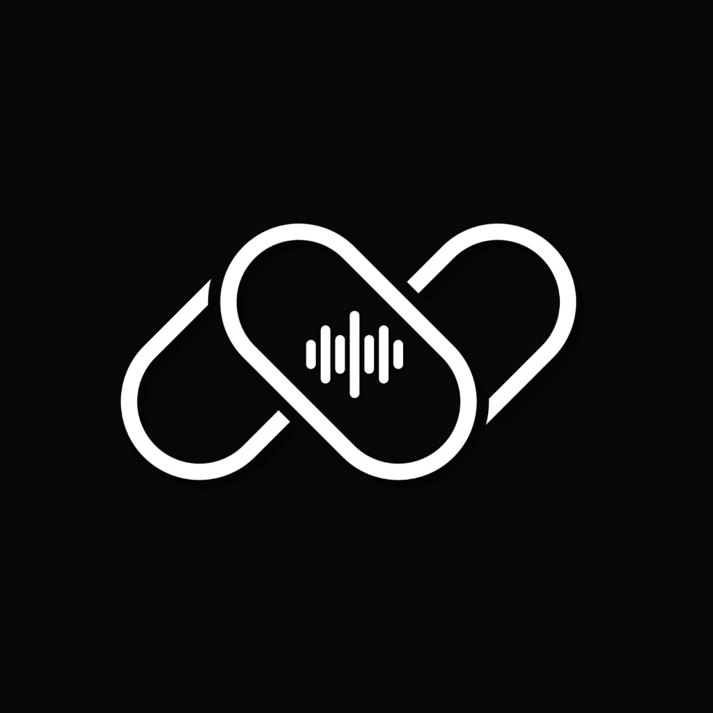
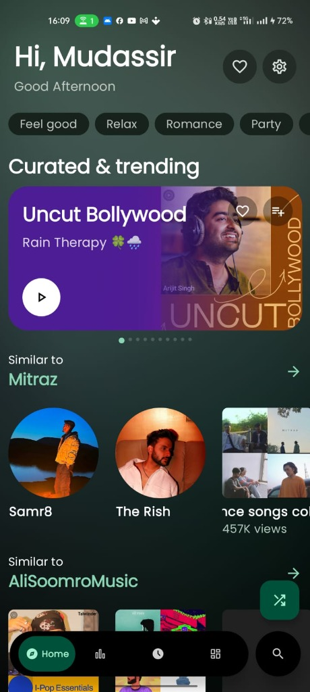
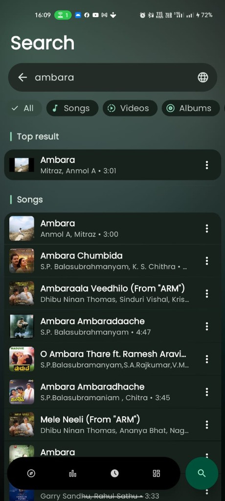
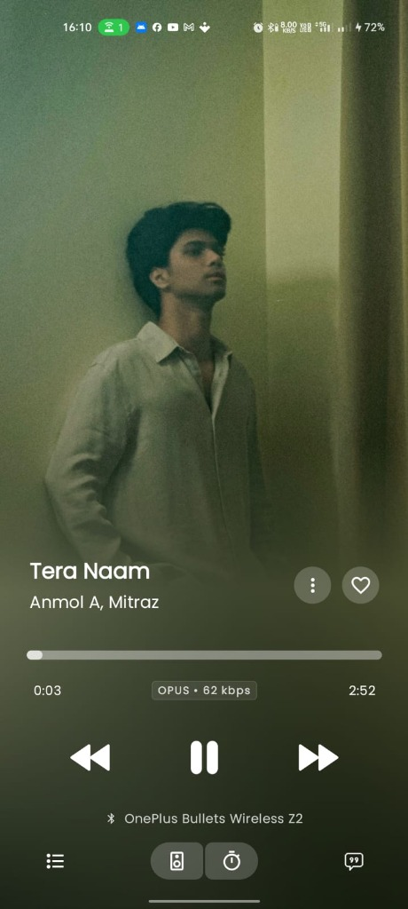
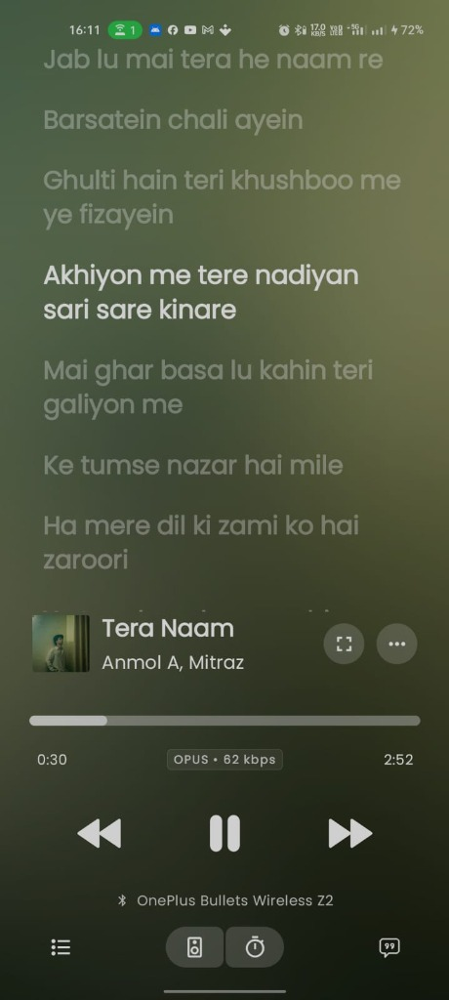

<div align="center">

  

  <h1>Nocturne</h1>

  <p align="center">
    <strong>Redefining the YouTube Music Experience on Android.</strong>
    <br />
    <em>High-performance, privacy-focused, and packed with an Apple Music-inspired player, live canvas artwork, and word-by-word synced lyrics.</em>
  </p>

  <p align="center">
    <a href="https://nocturne-music.vercel.app"><b>🌐 Official Website</b></a> •
    <a href="#-features"><b>✨ Features</b></a> •
    <a href="#-showcase"><b>📸 Showcase</b></a> •
    <a href="#-download-now"><b>📥 Download</b></a> •
    <a href="#-support-the-developer"><b>💖 Donate</b></a> •
    <a href="https://github.com/mudassir131-dev/nocturne/issues"><b>🐛 Issues</b></a>
  </p>

  <div align="center">
    <a href="https://github.com/mudassir131-dev/nocturne/releases/latest"></a>
    
    <a href="https://github.com/mudassir131-dev/nocturne/stargazers"></a>
    <a href="LICENSE"></a>
    
    
    
    
    
  </div>

</div>

<hr />

> [!IMPORTANT]
> **Website**: Explore features and stay up to date at [nocturne-music.vercel.app](https://nocturne-music.vercel.app).
>
> **Nocturne** isn't just another generic YouTube Music wrapper. It is a completely native Android music player crafted from the ground up using Kotlin, Jetpack Compose, and Media3/ExoPlayer for pure audio performance, privacy, and visual elegance.

---

## 📸 Showcase

<div align="center">

  
  
  
  

</div>

---

## ✨ Features

<div align="center">

<table>
  <tr>
    <td width="50%" valign="top">
      <div align="left">
        <h3>🎧 Playback & Streaming</h3>
        <ul>
          <li>Ad-free background streaming and instant playback</li>
          <li>YouTube Music & YouTube stream integration</li>
          <li>Local audio file and downloaded track playback</li>
          <li>Queue management, shuffle, repeat, and play-next</li>
          <li>Ultra-fast startup and smooth memory footprint</li>
          <li>Offline caching and full media downloads</li>
        </ul>
      </div>
    </td>
    <td width="50%" valign="top">
      <div align="left">
        <h3>🔊 High-Fidelity Audio</h3>
        <ul>
          <li>True Lossless mode & high-bitrate streaming</li>
          <li>Support for OPUS, AAC, and FLAC audio formats</li>
          <li>Real-time format, codec, and bitrate status badge</li>
          <li>Audio normalization & playback speed controls</li>
          <li>System equalizer & spatial audio integration</li>
        </ul>
      </div>
    </td>
  </tr>
  <tr>
    <td width="50%" valign="top">
      <div align="left">
        <h3>📜 Lyrics & Discovery</h3>
        <ul>
          <li>Real-time syllable & word-by-word synchronized lyrics</li>
          <li>Multi-source provider fallback (BetterLyrics, LRCLIB, KuGou, YouTube)</li>
          <li>Interactive lyrics seeking (tap to jump)</li>
          <li>Automatic romanization for Japanese and non-Latin scripts</li>
          <li>Personalized recommendations, Quick Picks & Forgotten Favorites</li>
          <li>Listening statistics across daily, weekly, and monthly periods</li>
        </ul>
      </div>
    </td>
    <td width="50%" valign="top">
      <div align="left">
        <h3>🤝 Sync & Social</h3>
        <ul>
          <li>Import & sync playlists directly from YouTube, Spotify, and Apple Music</li>
          <li>Discord Rich Presence with live playback metadata</li>
          <li>Last.fm and ListenBrainz scrobbling integration</li>
          <li>Music Together real-time synchronized listening rooms</li>
          <li>Android Auto and Glance home-screen widgets</li>
        </ul>
      </div>
    </td>
  </tr>
  <tr>
    <td width="50%" valign="top">
      <div align="left">
        <h3>🎨 Visual System & Themes</h3>
        <ul>
          <li>Apple Music-inspired full-bleed player design</li>
          <li>Nocturne Live Canvas dynamic video backdrops</li>
          <li>Material You dynamic color palette extraction</li>
          <li>Liquid Glassmorphism with customizable specular blur</li>
          <li>Floating responsive island navigation bar</li>
          <li>Dark, Light, and Pure Black AMOLED themes</li>
        </ul>
      </div>
    </td>
    <td width="50%" valign="top">
      <div align="left">
        <h3>⚙️ Customization</h3>
        <ul>
          <li>Multiple app launcher icons (Eclipse, Midnight, Aura, Pulse)</li>
          <li>Configurable player background styles and sliders</li>
          <li>Custom gesture actions (swipe-to-queue, seek jumps)</li>
          <li>Granular lyrics font size and auto-scroll duration settings</li>
          <li>Comprehensive privacy and network proxy controls</li>
        </ul>
      </div>
    </td>
  </tr>
</table>

</div>

---

## 📥 Download Now

<div align="center">

<h3>Stable Release</h3>

<table>
  <thead>
    <tr>
      <th align="center">Package</th>
      <th align="center">Target Architecture</th>
      <th align="center">Download Link</th>
    </tr>
  </thead>
  <tbody>
    <tr>
      <td align="center"><b>Universal Release APK</b></td>
      <td align="center">All devices (arm64, armeabi-v7a, x86_64)</td>
      <td align="center">
        <a href="https://github.com/mudassir131-dev/nocturne/releases/latest"><b>Download Universal APK</b></a>
      </td>
    </tr>
    <tr>
      <td align="center"><b>ARM64-v8a Release APK</b></td>
      <td align="center">Modern 64-bit Android devices (smaller size)</td>
      <td align="center">
        <a href="https://github.com/mudassir131-dev/nocturne/releases/latest"><b>Download ARM64 APK</b></a>
      </td>
    </tr>
  </tbody>
</table>

<p><em>Minimum requirement: Android 8.0 (Oreo) or higher.</em></p>

</div>

---

## 🌍 Supported Languages

Nocturne is fully localized across multiple regions:

| Language | Locale | Language | Locale |
| :--- | :--- | :--- | :--- |
| **English** | `en` | **Hindi (हिन्दी)** | `hi-rIN` |
| **Spanish (Español)** | `es` / `es-rES` | **French (Français)** | `fr` / `fr-rFR` |
| **German (Deutsch)** | `de-rDE` | **Russian (Русский)** | `ru` / `ru-rRU` |
| **Japanese (日本語)** | `ja` | **Korean (한국어)** | `ko` |
| **Chinese Simplified (简体中文)** | `zh-rCN` | **Portuguese (Português)** | `pt-rBR` |
| **Italian (Italiano)** | `it` | **Turkish (Türkçe)** | `tr` |
| **Indonesian (Bahasa Indonesia)** | `in-rID` | **Vietnamese (Tiếng Việt)** | `vi` |
| **Arabic (العربية)** | `ar` | **Hebrew (עברית)** | `iw` |
| **Dutch (Nederlands)** | `nl` | **Malay (Bahasa Melayu)** | `ms` |
| **Malayalam (മലയാളം)** | `ml` | **Estonian (Eesti)** | `et` |

---

## 🛠️ Building from Source

Nocturne is built on a high-performance modern Android toolchain:

1. **Clone the repository**:
   ```bash
   git clone https://github.com/mudassir131-dev/nocturne.git
   cd nocturne
   ```

2. **Compile with Gradle**:
   ```bash
   # Build Universal Debug APK
   ./gradlew assembleUniversalDebug

   # Run Unit Tests
   ./gradlew testUniversalDebugUnitTest
   ```

3. Output APK will be generated at:
   `app/build/outputs/apk/universal/debug/app-universal-debug.apk`

---

## 💖 Support the Developer

If you love using Nocturne and want to support its ongoing development, features, and server maintenance, you can donate directly via UPI:

<div align="center">

  <br />

  

  <br /><br />

  <a href="upi://pay?pa=touseeparay7-1@okicici&pn=Nocturne&cu=INR">
    
  </a>
  

  <br /><br />

  <p><b>UPI ID:</b> <code>touseeparay7-1@okicici</code></p>

</div>

---

## 📄 Open-Source Acknowledgments & Legal Disclaimer

### Acknowledgments
Nocturne is made possible thanks to the open-source community:
- [BetterLyrics](https://better-lyrics.boidu.dev/) for word-by-word synchronization and live artwork provider support.
- [SimpMusic](https://github.com/maxrave-dev/SimpMusic) & [LRCLIB](https://lrclib.net/) for lyrics backend services.
- [AndroidX Media3](https://developer.android.com/media/media3) & ExoPlayer for media playback.
- [Material Design 3](https://m3.material.io/) for expressive UI design tokens.

### Disclaimer
*Nocturne is an independent, community-driven open-source project and is not affiliated with, endorsed by, or sponsored by Google LLC, YouTube, Apple Inc., Spotify, or any of their subsidiaries.*

### License
Nocturne is licensed under the **GNU General Public License v3.0 (GPL-3.0)**. See the [LICENSE](LICENSE) file for complete details.

---

<div align="center">
  <p><b>If Nocturne elevated your music experience, please consider giving us a ⭐ on GitHub!</b></p>
</div>
