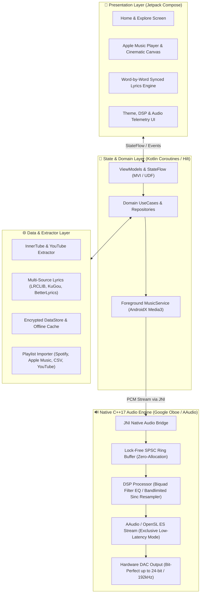

<div align="center">

  

  <h1>Nocturne</h1>

  <p align="center">
    <strong>The Next-Generation Native YouTube Music Experience for Android.</strong>
    <br />
    <em>Engineered with pure Kotlin & C++17 for audiophile-grade bit-perfect playback, an Apple Music-inspired fluid UI, dynamic live canvas artwork, and word-by-word synchronized lyrics.</em>
  </p>

  <p align="center">
    <a href="https://nocturne-music.vercel.app"><b>🌐 Official Website</b></a> •
    <a href="#-system-architecture"><b>🏛️ Architecture</b></a> •
    <a href="#-showcase"><b>📸 Showcase</b></a> •
    <a href="#-features"><b>✨ Features</b></a> •
    <a href="#-download-now"><b>📥 Download</b></a> •
    <a href="#-lead-developer--contributions"><b>👨‍💻 Contributor</b></a> •
    <a href="#-support-the-developer"><b>💖 Support</b></a>
  </p>

  <div align="center">
    <a href="https://github.com/mudassir131-dev/nocturne/releases/latest"></a>
    
    <a href="https://github.com/mudassir131-dev/nocturne/stargazers"></a>
    <a href="LICENSE"></a>
    
    
    
    
    
    
    
  </div>

</div>

<hr />

> [!IMPORTANT]
> **Nocturne** is not an electron app, hybrid wrapper, or generic WebView skin. It is an unapologetically native, high-performance Android music workstation designed from first principles. Powered by a **custom C++17 audio engine (Google Oboe / AAudio)**, **hardware-accelerated Jetpack Compose UI**, and **AndroidX Media3**, Nocturne delivers bit-perfect audio streaming, zero-latency DSP rendering, and complete freedom from advertisements and telemetry.

---

## 🏛️ System Architecture

Nocturne follows modern **Clean Architecture** with a strict **Unidirectional Data Flow (UDF / MVI-MVVM)** pattern. Audio playback is completely decoupled from the UI thread and driven through an asynchronous JNI bridge into a high-priority native C++ audio processing unit.


```mermaid
graph TD
    subgraph UI_Presentation ["📱 Presentation Layer (Jetpack Compose)"]
        UI_Home["Home & Explore Screen"]
        UI_Player["Apple Music Player & Cinematic Canvas"]
        UI_Lyrics["Word-by-Word Synced Lyrics Engine"]
        UI_Settings["Theme, DSP & Audio Telemetry UI"]
    end

    subgraph State_Domain ["🧠 State & Domain Layer (Kotlin Coroutines / Hilt)"]
        VM["ViewModels & StateFlow (MVI / UDF)"]
        UseCase["Domain UseCases & Repositories"]
        AudioService["Foreground MusicService (AndroidX Media3)"]
    end

    subgraph Audio_Pipeline ["🔊 Native C++17 Audio Engine (Google Oboe / AAudio)"]
        JNI["JNI Native Audio Bridge"]
        RingBuffer["Lock-Free SPSC Ring Buffer (Zero-Allocation)"]
        DSP["DSP Processor (Biquad Filter EQ / Bandlimited Sinc Resampler)"]
        AAudio["AAudio / OpenSL ES Stream (Exclusive Low-Latency Mode)"]
        DAC["Hardware DAC Output (Bit-Perfect up to 24-bit / 192kHz)"]
    end

    subgraph Data_Network ["🌐 Data & Extractor Layer"]
        YT["InnerTube & YouTube Extractor"]
        LyricsProvider["Multi-Source Lyrics (LRCLIB, KuGou, BetterLyrics)"]
        LocalCache["Encrypted DataStore & Offline Cache"]
        Importer["Playlist Importer (Spotify, Apple Music, CSV, YouTube)"]
    end

    UI_Presentation <-->|StateFlow / Events| VM
    VM --> UseCase
    UseCase --> AudioService
    AudioService -->|PCM Stream via JNI| JNI
    JNI --> RingBuffer
    RingBuffer --> DSP
    DSP --> AAudio
    AAudio --> DAC
    UseCase <--> Data_Network
```

### 🔬 Architectural Highlights

| Component | Technology | Responsibility |
| :--- | :--- | :--- |
| **Presentation** | **Jetpack Compose + Material 3** | Declarative UI, specular glassmorphism, dynamic color extraction, and hardware-accelerated animations. |
| **State Machine** | **Kotlin Flow + StateFlow + Hilt** | Strict unidirectional state updates, lifecycle-aware coroutines, and dependency injection. |
| **Media Controller** | **AndroidX Media3 (ExoPlayer)** | MediaSession tokens, audio routing, background service lifecycle, Android Auto, and system lockscreen controls. |
| **Native Engine** | **C++17 + Google Oboe / AAudio** | Low-latency audio processing in Exclusive mode to bypass the Android system mixer when possible. |
| **DSP Core** | **Direct Form II Transposed Biquads** | 10-Band parametric EQ, Bandlimited Sinc Resampling (Blackman-Nuttall windowed), and zero-phase distortion. |
| **Lock-Free Buffer** | **Atomic SPSC Ring Buffer** | Guarantees audio-thread safety with zero memory allocations or locks, preventing audio buffer underruns and stutter. |
| **Metadata & Lyrics** | **Ktor Client + Multi-Provider** | High-concurrency network extraction with multi-provider fallback for synced and romanized lyrics. |

---

## 📸 Showcase

<div align="center">

  <table>
    <tr>
      <td width="33.3%" align="center">
        <br />
        <b>🏠 Adaptive Home & Recommendations</b>
      </td>
      <td width="33.3%" align="center">
        <br />
        <b>🔍 Instant Search & Global Filters</b>
      </td>
      <td width="33.3%" align="center">
        <br />
        <b>🎬 Cinematic Player with Dynamic Blur</b>
      </td>
    </tr>
    <tr>
      <td width="33.3%" align="center">
        <br />
        <b>✨ Word-by-Word Syllable Synced Lyrics</b>
      </td>
      <td width="33.3%" align="center">
        <br />
        <b>🍎 Apple Music-Inspired Full Bleed UI</b>
      </td>
      <td width="33.3%" align="center">
        <br />
        <b>🇯🇵 Automatic Romaji & Translation</b>
      </td>
    </tr>
  </table>

</div>

---

## ✨ Features

<div align="center">

<table>
  <tr>
    <td width="50%" valign="top">
      <div align="left">
        <h3>🎧 Playback & Streaming</h3>
        <ul>
          <li><b>Ad-Free Background Playback:</b> Uninterrupted audio playback with screen off and system multitasking.</li>
          <li><b>High-Yield Stream Resolver:</b> Native YouTube Music stream extraction with multi-format fallback.</li>
          <li><b>Universal Queue Management:</b> Infinite auto-queue, shuffle, crossfade, and smart "play-next" stacking.</li>
          <li><b>Lossless Offline Downloads:</b> Cache tracks and full albums locally with embedded album artwork and metadata.</li>
          <li><b>Integrated Local Library:</b> Seamless playback of device audio files alongside online streams.</li>
        </ul>
      </div>
    </td>
    <td width="50%" valign="top">
      <div align="left">
        <h3>🔊 Native Audiophile Audio Engine</h3>
        <ul>
          <li><b>Google Oboe & AAudio Backend:</b> Ultra low-latency C++17 audio engine utilizing Android Exclusive hardware streams.</li>
          <li><b>Bit-Perfect Hi-Res Output:</b> Studio-quality audio support up to 24-bit / 192 kHz FLAC and ALAC.</li>
          <li><b>Bandlimited Sinc Resampler:</b> Windowed sinc interpolation (Blackman-Nuttall) ensuring pristine audio fidelity.</li>
          <li><b>10-Band Parametric Equalizer:</b> Zero-phase biquad filters with customizable frequency presets.</li>
          <li><b>Live Audio Telemetry:</b> Real-time in-app badge showing input vs DAC sample rate, bit depth, and audio route.</li>
        </ul>
      </div>
    </td>
  </tr>
  <tr>
    <td width="50%" valign="top">
      <div align="left">
        <h3>📜 Lyrics & Romaji Subsystem</h3>
        <ul>
          <li><b>Word-by-Word Syllable Sync:</b> Ultra-precise karaoke timing inspired by Apple Music.</li>
          <li><b>Multi-Source Redundancy:</b> Fallback chain spanning BetterLyrics, LRCLIB, KuGou, and YouTube.</li>
          <li><b>Tap-to-Seek Navigation:</b> Tap any lyric line or word to jump playback instantaneously.</li>
          <li><b>Automatic Romanization:</b> Converts Japanese (Kanji/Kana), Korean (Hangul), and Chinese into romanized script.</li>
          <li><b>Custom Typography:</b> Granular lyrics sizing, line spacing, and auto-centering scroll algorithms.</li>
        </ul>
      </div>
    </td>
    <td width="50%" valign="top">
      <div align="left">
        <h3>🔄 Playlist Migration & Discovery</h3>
        <ul>
          <li><b>Multi-Platform Importers:</b> One-click playlist import from Spotify, YouTube, and Apple Music (up to 5,000+ tracks).</li>
          <li><b>CSV Batch Importer:</b> Import large music catalogs via standard spreadsheet CSV files.</li>
          <li><b>Curated Recommendations:</b> Personalized Quick Picks, Forgotten Favorites, and Artist Radios.</li>
          <li><b>Listening Analytics:</b> Comprehensive listening statistics categorized across daily, weekly, and monthly trends.</li>
        </ul>
      </div>
    </td>
  </tr>
  <tr>
    <td width="50%" valign="top">
      <div align="left">
        <h3>🎨 Visual System & Fluid Animations</h3>
        <ul>
          <li><b>Live Canvas Video Backdrops:</b> Immersive animated background artwork for popular tracks.</li>
          <li><b>Liquid Glassmorphism:</b> Specular blur and dynamic luminance adaptation designed for OLED displays.</li>
          <li><b>Material 3 Expressive:</b> Morphing icons, dynamic theme palettes (Silver, Lavender, AMOLED, Sakura).</li>
          <li><b>Floating Island Navigation:</b> Sleek floating navigation bar responsive to user scroll state.</li>
        </ul>
      </div>
    </td>
    <td width="50%" valign="top">
      <div align="left">
        <h3>🌐 Connectivity & Social</h3>
        <ul>
          <li><b>Discord Rich Presence:</b> Real-time playback status, album art, and timestamps synced to your Discord profile.</li>
          <li><b>Scrobbler Integrations:</b> Native Last.fm and ListenBrainz background scrobbling.</li>
          <li><b>Android Auto Support:</b> Clean in-car audio controls and voice-compatible browsing.</li>
          <li><b>Interactive Widgets:</b> Glance home-screen widgets with playback controls and live album covers.</li>
        </ul>
      </div>
    </td>
  </tr>
</table>

</div>

---

## 👨‍💻 Lead Developer & Contributions

Nocturne is conceptualized, designed, and actively engineered by **Mudassir**:

<div align="center">

  <table style="border: none;">
    <tr>
      <td align="center" width="180">
        <a href="https://github.com/mudassir131-dev">
          
        </a>
      </td>
      <td align="left">
        <h3>Mudassir (mudassir131-dev)</h3>
        <p><b>Creator, Lead Architect & Maintainer</b></p>
        <p>
          <a href="https://github.com/mudassir131-dev"></a>
          <a href="https://nocturne-music.vercel.app"></a>
          <a href="https://portfolioooooss.vercel.app"></a>
          <a href="mailto:touseefparay7@gmail.com"></a>
        </p>
        <ul>
          <li>Engineered the <b>native C++17 DSP and Google Oboe / AAudio</b> low-latency audio processing pipeline.</li>
          <li>Designed and built the entire <b>Jetpack Compose Material 3 Expressive UI</b> with Liquid Glassmorphism.</li>
          <li>Created the <b>word-by-word syllable synced lyrics engine</b> with multi-source fallback and Romanization.</li>
          <li>Implemented high-capacity <b>Spotify & YouTube playlist importers</b> capable of handling thousands of songs.</li>
          <li>Integrated <b>Discord Rich Presence</b>, <b>Live Canvas Video Backdrops</b>, and <b>Audio Telemetry</b>.</li>
        </ul>
      </td>
    </tr>
  </table>

</div>

### 🤝 Contributing to Nocturne

We warmly welcome community contributions! Whether you want to improve audio processing, fix bugs, optimize performance, or add localizations:

1. **Fork the Repository** to your own GitHub account.
2. **Create a Feature Branch**: `git checkout -b feat/your-feature-name`.
3. **Commit your changes**: `git commit -m "feat: describe your change"`.
4. **Push to the branch**: `git push origin feat/your-feature-name`.
5. **Open a Pull Request** with detailed screenshots and explanations.

---

## 📥 Download Now

<div align="center">

<h3>Official Release Packages</h3>

<table>
  <thead>
    <tr>
      <th align="center">Package Variant</th>
      <th align="center">Target ABI Architecture</th>
      <th align="center">Recommended For</th>
      <th align="center">Download</th>
    </tr>
  </thead>
  <tbody>
    <tr>
      <td align="center"><b>Universal Release APK</b></td>
      <td align="center"><code>arm64-v8a</code>, <code>armeabi-v7a</code>, <code>x86_64</code></td>
      <td align="center">All Android devices (Universal compatibility)</td>
      <td align="center">
        <a href="https://github.com/mudassir131-dev/nocturne/releases/latest"><b>📦 Download Universal</b></a>
      </td>
    </tr>
    <tr>
      <td align="center"><b>ARM64 Optimized APK</b></td>
      <td align="center"><code>arm64-v8a</code></td>
      <td align="center">Modern 64-bit phones (Smaller package footprint)</td>
      <td align="center">
        <a href="https://github.com/mudassir131-dev/nocturne/releases/latest"><b>⚡ Download ARM64</b></a>
      </td>
    </tr>
  </tbody>
</table>

<p><em>Compatible with Android 8.0 (API Level 26) through Android 15 & 16 Developer Previews.</em></p>

</div>

---

## 🌍 Supported Languages

Nocturne is fully localized across 20+ languages worldwide:

| Language | Locale | Language | Locale |
| :--- | :--- | :--- | :--- |
| **English** | `en` | **Hindi (हिन्दी)** | `hi-rIN` |
| **Spanish (Español)** | `es` / `es-rES` | **French (Français)** | `fr` / `fr-rFR` |
| **German (Deutsch)** | `de-rDE` | **Russian (Русский)** | `ru` / `ru-rRU` |
| **Japanese (日本語)** | `ja` | **Korean (한국어)** | `ko` |
| **Chinese Simplified (简体中文)** | `zh-rCN` | **Portuguese (Português)** | `pt-rBR` |
| **Italian (Italiano)** | `it` | **Turkish (Türkçe)** | `tr` |
| **Indonesian (Bahasa Indonesia)** | `in-rID` | **Vietnamese (Tiếng Việt)** | `vi` |
| **Arabic (العربية)** | `ar` | **Hebrew (עברית)** | `iw` |
| **Dutch (Nederlands)** | `nl` | **Malay (Bahasa Melayu)** | `ms` |
| **Malayalam (മലയാളം)** | `ml` | **Estonian (Eesti)** | `et` |

---

## 🛠️ Building from Source

Nocturne requires modern Android development tools to compile native C++ and Kotlin code:

### Prerequisites
- **Android Studio** Ladybug (2024.2.1+) or newer
- **Android NDK** `27.0.12077973`
- **CMake** `3.22.1+`
- **JDK** `17` or `21`

### Build Instructions

```bash
# 1. Clone the repository
git clone https://github.com/mudassir131-dev/nocturne.git
cd nocturne

# 2. Build the Universal Debug APK
./gradlew assembleUniversalDebug

# 3. Run all unit tests
./gradlew testUniversalDebugUnitTest
```

The compiled APK will be located at:
`app/build/outputs/apk/universal/debug/app-universal-debug.apk`

---

## 💖 Support the Developer

If Nocturne made your music listening smoother, richer, and ad-free, consider supporting ongoing development, server costs, and new features:

<div align="center">

  <br />

  

  <br /><br />

  <a href="upi://pay?pa=touseeparay7-1@okicici&pn=Nocturne&cu=INR">
    
  </a>
  

  <br /><br />

  <p><b>UPI ID:</b> <code>touseeparay7-1@okicici</code></p>

</div>

---

## 📄 Open-Source Acknowledgments & Legal Disclaimer

### Acknowledgments
Nocturne stands on the shoulders of remarkable open-source projects:
- [Google Oboe](https://github.com/google/oboe) — Low-latency native audio streaming on Android.
- [BetterLyrics](https://better-lyrics.boidu.dev/) — Word-by-word synced lyrics and rich artwork provider.
- [SimpMusic](https://github.com/maxrave-dev/SimpMusic) & [LRCLIB](https://lrclib.net/) — Open lyrics catalog.
- [AndroidX Media3](https://developer.android.com/media/media3) & ExoPlayer — Modern media engine.
- [Material Design 3](https://m3.material.io/) — Expressive UI guidelines and token system.

### Legal Disclaimer
*Nocturne is an independent, community-driven open-source project and is not affiliated with, endorsed by, or sponsored by Google LLC, YouTube, Apple Inc., Spotify, or any of their subsidiaries.*

### License
Nocturne is licensed under the **GNU General Public License v3.0 (GPL-3.0)**. See the [LICENSE](LICENSE) file for details.

---

<div align="center">
  <p><b>Crafted with ❤️ by <a href="https://github.com/mudassir131-dev">Mudassir</a> for music lovers worldwide.</b></p>
  <p><em>If you love Nocturne, don't forget to star ⭐ the repository!</em></p>
</div>
