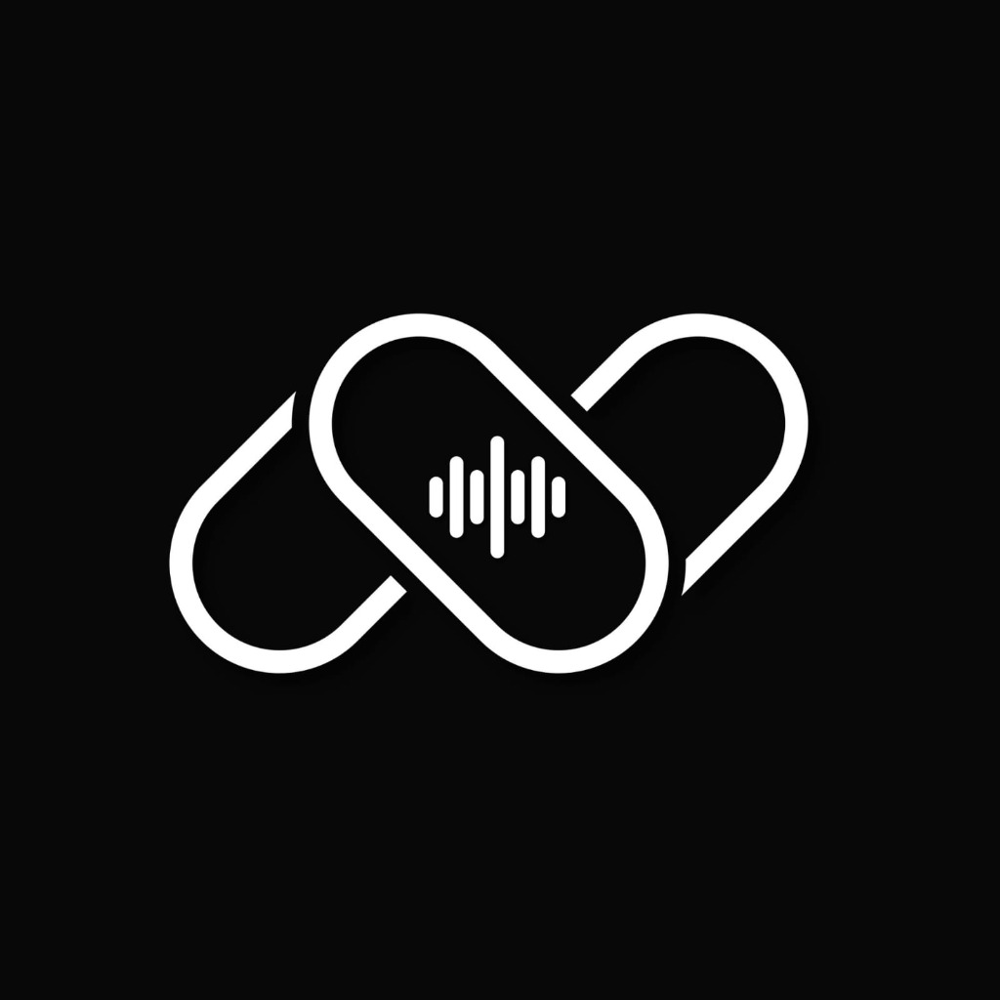
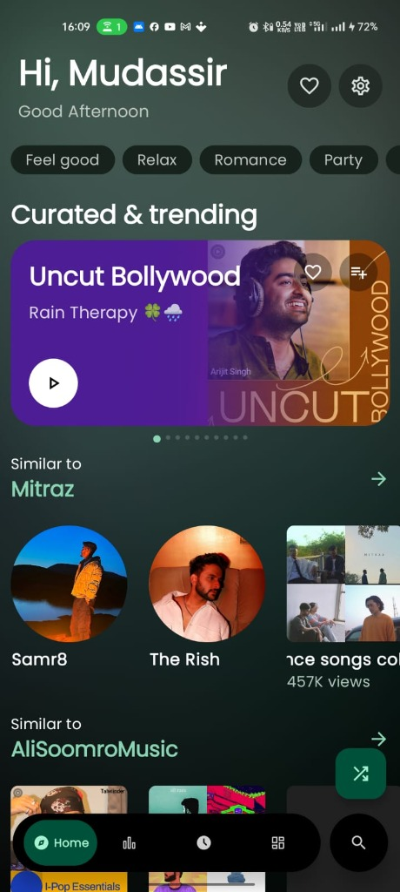
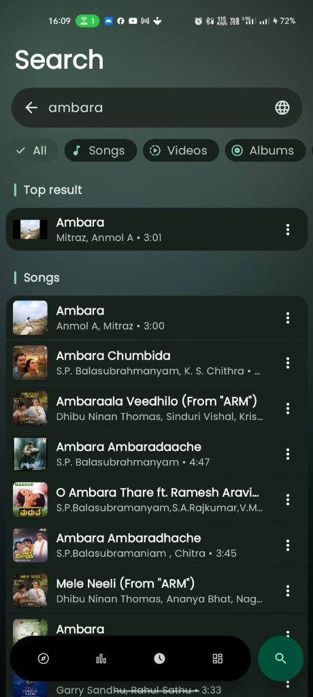
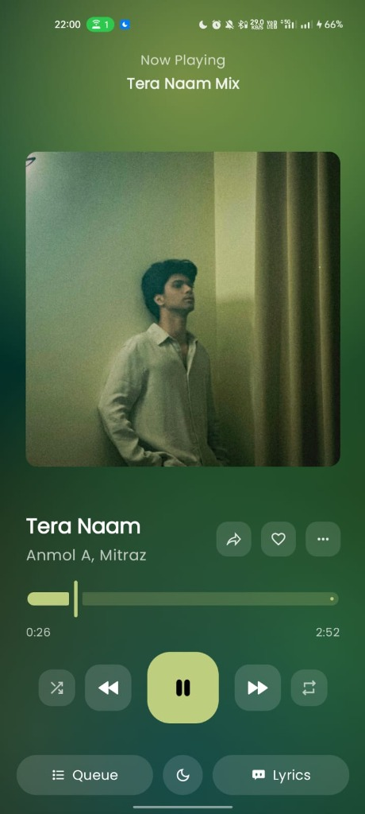
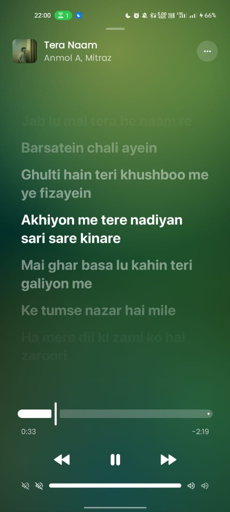
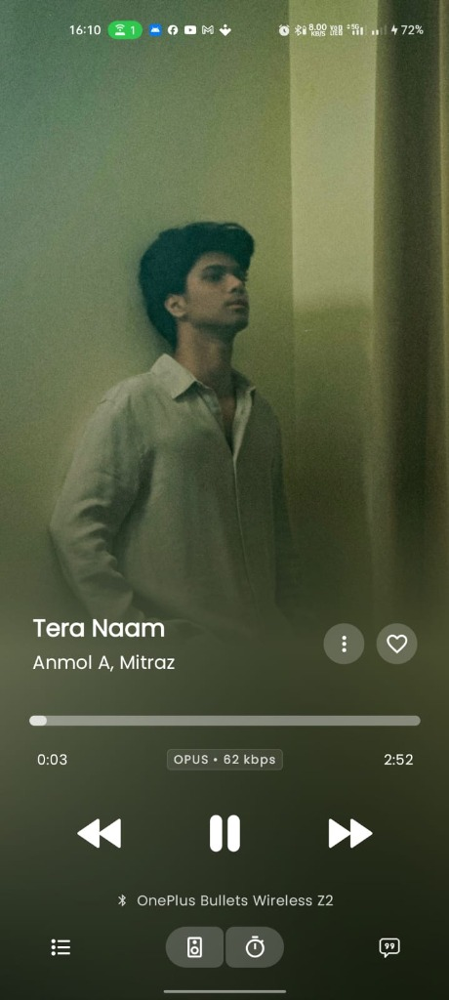
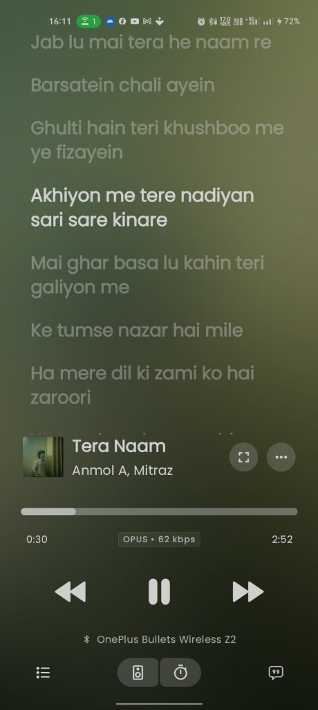
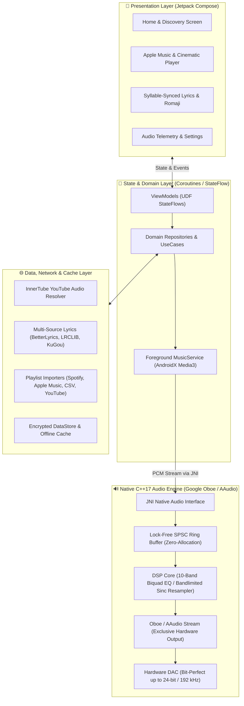

<div align="center">

  

  <h1>Nocturne</h1>

  <p align="center">
    <a href="README.md">
      
    </a>
    <a href="README.md#-%EF%B8%8F-globalization">
      
    </a>
  </p>

  <p align="center">
    <strong>Redefining the YouTube Music Experience on Android.</strong>
    <br />
    <em>High-performance, privacy-focused, and packed with an Apple Music-inspired player, native C++ audio engine, live canvas artwork, and word-by-word synced lyrics.</em>
  </p>

  <p align="center">
    <a href="https://nocturne-music.vercel.app"><b>Official Website</b></a> •
    <a href="#features"><b>Features</b></a> •
    <a href="#system-architecture"><b>Architecture</b></a> •
    <a href="#download-now"><b>Download</b></a> •
    <a href="#screenshots"><b>Screenshots</b></a> •
    <a href="#project-contributors"><b>Contributors</b></a> •
    <a href="https://github.com/mudassir131-dev/nocturne/issues"><b>Support</b></a>
  </p>

  <div align="center">
    <a href="https://github.com/mudassir131-dev/nocturne/releases/latest"></a>
    
    <a href="https://github.com/mudassir131-dev/nocturne/stargazers"></a>
    <a href="LICENSE"></a>
    
    
    
    
    
    <a href="https://github.com/mudassir131-dev/nocturne/releases/latest" target="_blank"></a>
    <a href="https://nocturne-music.vercel.app"></a>
    <a href="https://github.com/mudassir131-dev/nocturne/issues"></a>
  </div>

</div>

<hr />

> [!WARNING]
> **Forks and unofficial builds are not supported.**  
> We do not provide maintenance, support, or troubleshooting for third-party modified APKs. Download only from official releases.

**Nocturne** isn’t just another generic YouTube Music wrapper. It’s a fully custom-built native audio player made from the ground up using **Kotlin**, **C++17 (Google Oboe / AAudio)**, and **Jetpack Compose**. If you care about bit-perfect sound quality, uninterrupted ad-free playback, and an interface that genuinely feels alive, Nocturne was created for you.

---

> [!IMPORTANT]  
> **Geographic Availability:** If YouTube Music streaming is restricted in your region or network, an initial VPN or custom network proxy setting within the app may be required for track resolution.

---

## 📸 Showcase

<div align="center" id="screenshots">

  <p>
    
    
    
  </p>
  <p>
    
    
    
  </p>

</div>

---

## 🏛️ System Architecture

<div align="left" id="system-architecture">

Nocturne is built upon a reactive, decoupled multi-layered architecture combining **Unidirectional Data Flow (UDF / MVI)** on Android with a low-latency **C++17 native DSP engine**.


```mermaid
graph TD
    subgraph UI_Layer ["📱 Presentation Layer (Jetpack Compose)"]
        UI_Home["Home & Discovery Screen"]
        UI_Player["Apple Music & Cinematic Player"]
        UI_Lyrics["Syllable-Synced Lyrics & Romaji"]
        UI_Settings["Audio Telemetry & Settings"]
    end

    subgraph State_Layer ["🧠 State & Domain Layer (Coroutines / StateFlow)"]
        VM["ViewModels (UDF StateFlows)"]
        Domain["Domain Repositories & UseCases"]
        Service["Foreground MusicService (AndroidX Media3)"]
    end

    subgraph Native_Audio ["🔊 Native C++17 Audio Engine (Google Oboe / AAudio)"]
        JNI["JNI Native Audio Interface"]
        RingBuf["Lock-Free SPSC Ring Buffer (Zero-Allocation)"]
        DSP["DSP Core (10-Band Biquad EQ / Bandlimited Sinc Resampler)"]
        Oboe["Oboe / AAudio Stream (Exclusive Hardware Output)"]
        DAC["Hardware DAC (Bit-Perfect up to 24-bit / 192 kHz)"]
    end

    subgraph Data_Layer ["🌐 Data, Network & Cache Layer"]
        YT["InnerTube YouTube Audio Resolver"]
        Lyrics["Multi-Source Lyrics (BetterLyrics, LRCLIB, KuGou)"]
        Importer["Playlist Importers (Spotify, Apple Music, CSV, YouTube)"]
        DataStore["Encrypted DataStore & Offline Cache"]
    end

    UI_Layer <-->|State & Events| VM
    VM --> Domain
    Domain --> Service
    Service -->|PCM Stream via JNI| JNI
    JNI --> RingBuf
    RingBuf --> DSP
    DSP --> Oboe
    Oboe --> DAC
    Domain <--> Data_Layer
```

</div>

---

## ✨ Features

<div align="center" id="features">

<table>
  <tr>
    <td width="50%" valign="top">
      <div align="left">
        <h3>🎧 Playback</h3>
        <ul>
          <li>Ad-free background streaming with screen off</li>
          <li>Instant playback with ultra-low startup latency</li>
          <li>Universal queue management: infinite auto-queue, shuffle, repeat</li>
          <li>Local device audio file playback alongside online tracks</li>
          <li>Offline media downloads with full tags and embedded artwork</li>
          <li>Lightweight memory footprint with battery optimization modes</li>
        </ul>
      </div>
    </td>
    <td width="50%" valign="top">
      <div align="left">
        <h3>🔊 Audio Engine &amp; DSP</h3>
        <ul>
          <li><b>Google Oboe &amp; AAudio C++17 Pipeline</b> in Exclusive Mode</li>
          <li><b>Hi-Res Lossless &amp; Bit-Perfect Output</b> up to 24-bit / 192 kHz</li>
          <li><b>Bandlimited Sinc Resampler</b> with Blackman-Nuttall windowing</li>
          <li><b>Lock-Free SPSC Ring Buffer</b> preventing glitches and underruns</li>
          <li><b>10-Band Parametric Equalizer</b> with Direct Form II Transposed biquads</li>
          <li><b>Live In-App Audio Telemetry Badge</b> (Source vs DAC rate, route)</li>
        </ul>
      </div>
    </td>
  </tr>
  <tr>
    <td width="50%" valign="top">
      <div align="left">
        <h3>📜 Lyrics &amp; Discovery</h3>
        <ul>
          <li>Real-time syllable and word-by-word synced lyrics</li>
          <li>Multi-provider fallback (BetterLyrics, LRCLIB, KuGou, YouTube)</li>
          <li>Interactive tap-to-seek lyrics navigation</li>
          <li>Automatic Romanization for Japanese (Romaji), Korean, and Chinese</li>
          <li>Personalized recommendations: Quick Picks &amp; Forgotten Favorites</li>
          <li>Comprehensive daily, weekly, and monthly listening statistics</li>
        </ul>
      </div>
    </td>
    <td width="50%" valign="top">
      <div align="left">
        <h3>🔄 Sync &amp; Social</h3>
        <ul>
          <li>Large playlist import from Spotify, YouTube, and Apple Music (up to 5,000+ songs)</li>
          <li>CSV file batch playlist migration</li>
          <li>Discord Rich Presence with live playback metadata and cover art</li>
          <li>Last.fm and ListenBrainz background scrobbling</li>
          <li>Android Auto integration and Glance home-screen widgets</li>
        </ul>
      </div>
    </td>
  </tr>
  <tr>
    <td width="50%" valign="top">
      <div align="left">
        <h3>🎨 Interface</h3>
        <ul>
          <li>Material 3 Expressive design language</li>
          <li>Apple Music-inspired full-bleed immersive player</li>
          <li>Live Canvas dynamic video backdrop animations</li>
          <li>Liquid Glassmorphism with customizable specular blur</li>
          <li>Floating responsive island navigation bar</li>
          <li>Adaptive OLED Pure Black, Dark, and Light palettes</li>
        </ul>
      </div>
    </td>
    <td width="50%" valign="top">
      <div align="left">
        <h3>⚙️ Customization</h3>
        <ul>
          <li>Deep audio processing and resampling configurations</li>
          <li>Multiple app launcher icons (Eclipse, Midnight, Aura, Pulse)</li>
          <li>Configurable gestures (swipe-to-queue, double-tap seek)</li>
          <li>Granular lyrics typography and smooth auto-scroll tuning</li>
          <li>Network proxy and custom DNS routing controls</li>
        </ul>
      </div>
    </td>
  </tr>
</table>

</div>

---

## 📥 Download Now

<div align="center" id="download-now">

<h2>Official Stable Release</h2>

<table>
  <thead>
    <tr>
      <th align="center" width="50%">GitHub Releases</th>
      <th align="center" width="50%">Official Website</th>
    </tr>
  </thead>
  <tbody>
    <tr>
      <td align="center">
        <a href="https://github.com/mudassir131-dev/nocturne/releases/latest">
          
        </a>
      </td>
      <td align="center">
        <a href="https://nocturne-music.vercel.app">
          
        </a>
      </td>
    </tr>
  </tbody>
</table>

<br />

<table>
  <thead>
    <tr>
      <th align="center">Package Variant</th>
      <th align="center">Target ABI Architecture</th>
      <th align="center">Recommended Devices</th>
      <th align="center">Download Link</th>
    </tr>
  </thead>
  <tbody>
    <tr>
      <td align="center"><b>Universal Release APK</b></td>
      <td align="center"><code>arm64-v8a</code>, <code>armeabi-v7a</code>, <code>x86_64</code></td>
      <td align="center">All Android devices (Full compatibility)</td>
      <td align="center">
        <a href="https://github.com/mudassir131-dev/nocturne/releases/latest"><b>📦 Download Universal APK</b></a>
      </td>
    </tr>
    <tr>
      <td align="center"><b>ARM64 Optimized APK</b></td>
      <td align="center"><code>arm64-v8a</code></td>
      <td align="center">Modern 64-bit phones (Smaller package footprint)</td>
      <td align="center">
        <a href="https://github.com/mudassir131-dev/nocturne/releases/latest"><b>⚡ Download ARM64 APK</b></a>
      </td>
    </tr>
  </tbody>
</table>

<p><em>Minimum requirement: Android 8.0 (Oreo / API Level 26) or higher.</em></p>

</div>

> [!WARNING]  
> **Notes:** The trusted download sources are listed above; we are not responsible for any risks or malwares encountered from downloading from unauthorized third-party sites.

---

## ❓ Need Help or Have Questions?
Join the community, report bugs, or request features directly via our channels:

[](https://nocturne-music.vercel.app)
[](https://github.com/mudassir131-dev/nocturne/issues)
[](https://github.com/mudassir131-dev/nocturne)

---

## 🌍 Globalization

Nocturne belongs to music lovers worldwide. The application is localized across 20+ regions:

| Language | Locale | Language | Locale |
| :--- | :--- | :--- | :--- |
| **English** | `en` | **Hindi (हिन्दी)** | `hi-rIN` |
| **Spanish (Español)** | `es` / `es-rES` | **French (Français)** | `fr` / `fr-rFR` |
| **German (Deutsch)** | `de-rDE` | **Russian (Русский)** | `ru` / `ru-rRU` |
| **Japanese (日本語)** | `ja` | **Korean (한국어)** | `ko` |
| **Chinese Simplified (简体中文)** | `zh-rCN` | **Portuguese (Português)** | `pt-rBR` |
| **Italian (Italiano)** | `it` | **Turkish (Türkçe)** | `tr` |
| **Indonesian (Bahasa Indonesia)** | `in-rID` | **Vietnamese (Tiếng Việt)** | `vi` |
| **Arabic (العربية)** | `ar` | **Hebrew (עברית)** | `iw` |
| **Dutch (Nederlands)** | `nl` | **Malay (Bahasa Melayu)** | `ms` |
| **Malayalam (മലയാളം)** | `ml` | **Estonian (Eesti)** | `et` |

---

## 👨‍💻 Project Contributors

<div align="center" id="project-contributors">

  <table style="border: none;">
    <tr>
      <td align="center" width="160">
        <a href="https://github.com/mudassir131-dev">
          
        </a>
      </td>
      <td align="left">
        <h3>Mudassir (mudassir131-dev)</h3>
        <p><b>Creator, Lead Architect & Maintainer</b></p>
        <p>
          <a href="https://github.com/mudassir131-dev"></a>
          <a href="https://nocturne-music.vercel.app"></a>
          <a href="https://portfolioooooss.vercel.app"></a>
          <a href="mailto:touseefparay7@gmail.com"></a>
        </p>
        <ul>
          <li><b>Architected the entire application:</b> Designed the reactive MVI / UDF structure and state lifecycle.</li>
          <li><b>Native C++17 Audio Engine:</b> Developed the Google Oboe / AAudio integration, parametric equalizer, and bandlimited sinc resampler.</li>
          <li><b>Jetpack Compose UI/UX:</b> Created the Apple Music-inspired fluid player, live canvas video backdrops, and glassmorphism.</li>
          <li><b>Word-by-Word Synced Lyrics:</b> Built the real-time syllable timing parser with Romaji conversion.</li>
          <li><b>Migration Engine:</b> Implemented 5,000+ song import pipelines for Spotify and YouTube playlists.</li>
        </ul>
      </td>
    </tr>
  </table>

  <br />

  <a href="https://github.com/mudassir131-dev/nocturne/graphs/contributors">
    
  </a>

</div>

### 🛠️ Development & Engineering
Interested in building the project or contributing? Nocturne is built on a high-performance modern Android toolchain:

```bash
# 1. Clone the repository
git clone https://github.com/mudassir131-dev/nocturne.git
cd nocturne

# 2. Build the Universal Debug APK
./gradlew assembleUniversalDebug

# 3. Run unit tests
./gradlew testUniversalDebugUnitTest
```

---

## 💖 Support the Developer

If Nocturne elevated your music experience, consider supporting ongoing development, servers, and future features:

<div align="center">

  <br />

  

  <br /><br />

  <a href="upi://pay?pa=touseeparay7-1@okicici&pn=Nocturne&cu=INR">
    
  </a>
  

  <br /><br />

  <p><b>UPI ID:</b> <code>touseeparay7-1@okicici</code></p>

</div>

---

## 📄 Open-Source Acknowledgments

Nocturne is made possible by the incredible open-source community:

- **Google Oboe** for low-latency native audio streaming on Android.
- **BetterLyrics** for word-by-word syllable synced lyrics and artwork providers.
- **SimpMusic** & **LRCLIB** for open lyrics catalog and API integration.
- **AndroidX Media3 & ExoPlayer** for robust background media playback.
- **Material Design 3** for expressive visual design tokens.
- Translators, testers, and contributors who make Nocturne better every day.

---

## ⚖️ Legal Disclaimer

Nocturne is an independent third-party client.
- Not affiliated with, endorsed by, or sponsored by Google LLC, YouTube, Apple Inc., or Spotify.
- Does not bypass YouTube's technical protections.
- Users are encouraged to support artists by purchasing music via official channels.

## ⚖️ License, Copyright, and Trademark Notice

Nocturne is licensed under the **GNU General Public License v3.0 (GPLv3)**.

You may copy, modify, and redistribute the source code, including commercially, provided that you comply with the GPLv3. This includes preserving applicable copyright and license notices, clearly identifying modified versions, and providing the corresponding source code when required.

Copyright © Mudassir and Nocturne contributors for their respective original contributions.

The **Nocturne™** name, logo, application icon, and branding are not licensed under the GPLv3. Unofficial forks must not present themselves as official Nocturne releases.

See the [`LICENSE`](LICENSE) file for the complete GPLv3 terms.

---

<div align="center">
  <p><b>If Nocturne elevated your music experience, please consider giving us a ⭐ on GitHub!</b></p>
</div>
